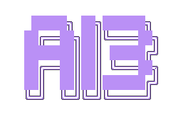

<p align="center">
  
</p>

<p align="center">
  <em>What if your window manager could think?</em>
</p>

<p align="center">
  
  <a href="https://i3wm.org/"></a>
  <a href="https://openai.com/"></a>
</p>

<p align="center">
  <a href="#what-is-this">About</a> •
  <a href="#demo">Demo</a> •
  <a href="#features">Features</a> •
  <a href="#installation">Install</a> •
  <a href="#usage">Usage</a>
</p>

---

> **⚠️ EXPERIMENTAL PROJECT - NOT FOR PRODUCTION USE**
>
> This is an experimental research project exploring AI-integrated window management. It is intended for testing and experimentation only. Do not use in production environments or with sensitive data.

> **Note:** Currently all AI requests are sent to OpenAI's API. Support for additional providers (including local models) may be added in the future.

## Demo


The demo above shows:
- **Layout optimization** (`Ctrl+Shift+O`) — AI reorganizes windows based on your current workflow
- **Chat with function calling** — Natural language conversation with direct access to i3's IPC interface
- **Next action prediction** — AI anticipates your next move based on keyboard input (e.g., suggesting actions after `ls -al`)

## What is this?

ai3 is an experimental AI-powered window manager assistant that integrates OpenAI's language models directly into the [i3 window manager](https://i3wm.org/). This project explores what a **future AI-native operating system or window server** could look like—where AI is deeply embedded into the core desktop experience, not just bolted on as an afterthought.

The window manager communicates with OpenAI's API to understand your desktop context, predict your next actions, optimize window layouts, and respond to natural language commands about your workspace.

### Vision

This project envisions a future where:
- Your window manager **understands intent**, not just commands
- AI can **see and reason** about your entire desktop state
- Natural language replaces memorizing keyboard shortcuts
- The OS **anticipates** what you need before you ask
- Window management becomes a **conversation**, not a configuration file

### Why a fork?

Currently, ai3 works entirely through i3's existing IPC protocol—no modifications to i3 itself are required. We regularly sync with upstream i3 to stay current. However, this repository is maintained as a fork to keep the door open for deeper integration in the future, should we explore changes at the window manager level.

## Features

- **Next Action Prediction**: AI predicts and suggests your next window management action
- **Layout Optimization**: AI analyzes and optimizes your window layout
- **Chat Mode**: Interactive chat with full context of your i3 environment
- **Tools**: All i3 functionality exposed as tools for AI agents
- **i3bar Integration**: AI status displayed in the i3 status bar
- **Screenshot Analysis**: AI can see your screen to provide contextual help

## How It Works

1. ai3 connects to i3wm via its IPC interface
2. Your desktop state (windows, workspaces, layouts) is exposed as context to AI agents
3. OpenAI agents can see your desktop and execute i3 commands as tools
4. You interact via CLI, keyboard shortcuts, or the status bar

## Getting Started

```bash
# Set your OpenAI API key
export OPENAI_KEY="your-api-key"

# Start ai3 desktop environment
./ai3-cli/ai3 start
```

This spins up a containerized i3 desktop with AI features and opens it in your browser via noVNC.

## Architecture

```
ai3-cli/          # CLI for starting/managing ai3 desktop
ai3-server/       # Backend: AI agents, i3 IPC, FastAPI server
```

## Tools

The following i3 operations are exposed as tools:

- `get_workspaces` - List all workspaces
- `get_windows` - List all windows with details
- `get_focused_window` - Get currently focused window
- `get_tree` - Get full container tree
- `focus_window` - Focus a specific window
- `move_window` - Move window to workspace/direction
- `resize_window` - Resize a window
- `set_layout` - Change container layout
- `run_command` - Execute any i3 command
- `get_outputs` - Get display outputs
- `screenshot` - Capture current screen